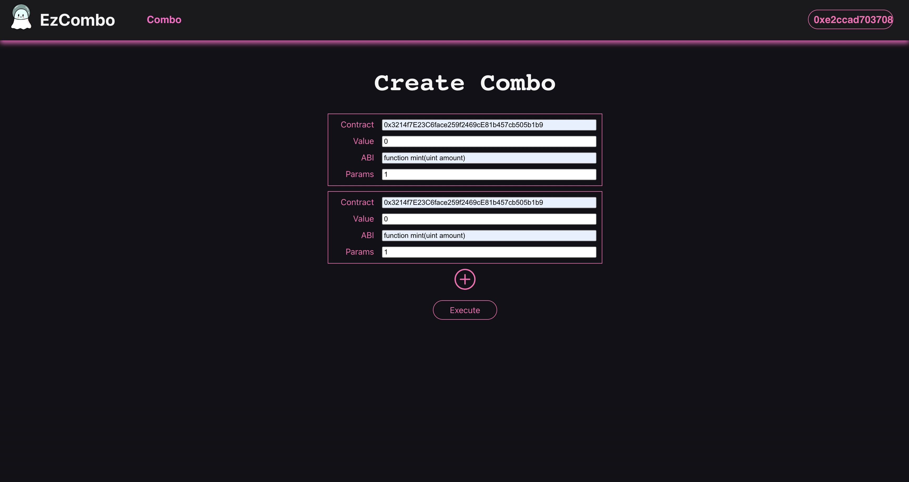

# EzCombo

## Demo: Click on the image below

[](https://youtu.be/8GFhZNEFm5c "Demo Video")

Combo Page:


Combo Factory deployed at: 0xE9A78a271970E93f211b23e893c5248850408a6D

Combo Implementation deployed at:
0xaB9e5E2ddC9D765Ef95D388d1F66b28fe98888b2

on Mantle Testnet

## Problem

A bunch of regularly used transactions like multiple token transfer, approve and transfer and much more than transaction from the user and this not only wastes a lot of user time but also gas fees in terms of base fees.

## Solution

We've created an on chain batching layer that allows users to batch multiple transactions into a single transaction through smart contract layer.

## What's in it for the developers?

Developers can utilise this layer and build on top of it, applications like - arbitrage tools where user can take out flashloans from Aave, perform multiple transactions across different liquidity pools and then pay back. This can also be used in places where user needs to transfer multiple tokens to multiple users and more.

## What's next?

In built functionality like swaps, multisigs and more for sure.

---

## How do I try it out ?

In the frontend directory, run:

```
npm start
```

and that's it. <br>

Though if this seems like too much effort, check out the demo video and feel free to reach out on discord: Ace011#5743
